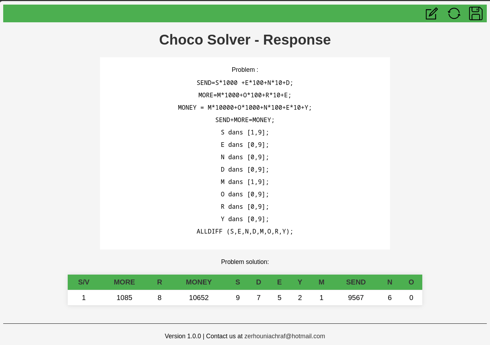

# IHM for ChocoSolver

## Description
IHM for ChocoSolver is an application that allows users to define and solve constraint satisfaction problems. It provides an intuitive interface for formulating problems and leveraging the ChocoSolver library to find solutions.

## Technologies Used
- Java
- Spring Framework
- Maven
- ChocoSolver
- JUnit
- Bison
- JFlex

## Quickstart Guide

### Prerequisites

- Java JDK 17 or higher
- Maven

### Testing
```bash
mvn test
```

### Building
```bash
mvn clean package
```

### Running
```bash
mvn spring-boot:run
```

The application will run at localhost:8080


## Usage
1. Open the application in your web browser.
2. Use the main page to define your constraint satisfaction problem by providing the necessary details.
3. Click the "Solve" button to solve the problem.
4. Navigate to the solution page to view the results and explore the solution space.
5. Use the provided features to export the solutions in CSV format.

## Included Problem Scripts
The application includes two sample problem scripts located in the `scripts` directory. You can easily copy and paste the content of these files into the problem description text area to test the application.

## Known Limitations
The application does not support values outside the range of -9999999 to 9999999.

## Contact Information
For any inquiries, bug reports, or feature requests, please contact the developer at zerhouniachraf@hotmail.com.

## Application Screenshot

Below is a screenshot of the main page of the application. This gives you a quick look at the user interface.



